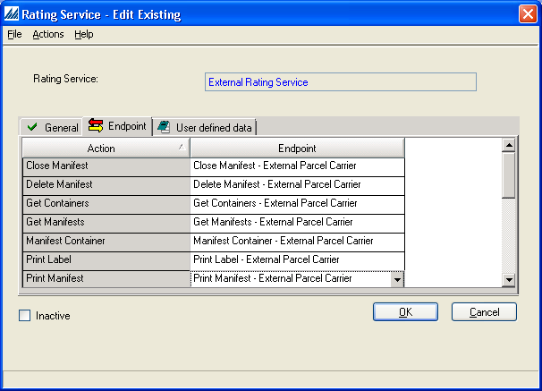

    

        
    

    

        
            
Manhattan Active SCALE Documentation

        

Rating Service Endpoints

    

    

         
                <label class="i-collapse-all" data-source-node="n39">Collapse All</label>
                <label class="i-expand-all" data-source-node="n40">Expand All</label>
            
        <a class="i-page-link i-view-in-frame-link" title="Open this Topic in a view that includes Navigation tools (Table of Contents, Index, Search)" data-source-node="n41">View with Navigation Tools</a>
    

    
<table data-source-node="n43"><tr data-source-node="n44"><td data-source-node="n45">
<a href="151fb685ffa48d0988636095b3af7881bab2d21e6ea0f1f1f260a337c40eebce.html" data-source-node="n46">Integration Endpoints</a>
 &gt; Rating Service Endpoints</td></tr></table>

    
    
    

        
Rating Service Endpoints are API style Integration Endpoints invoked when interacting with a custom Rating Server. They are configured at the Rating Service level, as shown below:

 

 

Visit the following list of topics for specific information about each Rating Service Action: 

<ul data-source-node="n55">
    <li data-source-node="n56"><a href="5e5b24e4a40edc9ce8900fc0b4e9f636ca1fc6815b368b78808390aa9cc4ac90.html" data-source-node="n57">Close Manifest</a></li>

    <li data-source-node="n58"><a href="8bd1b9ea0c8b43ccd16faf0a805b64b6d180fb0be86a73a4c19412e4b9ea12a8.html" data-source-node="n59">Delete Manifest</a></li>

    <li data-source-node="n60"><a href="b59569c2c29c783e1c917602ed919011cfaf96335c09699494af6846b9d1f749.html" data-source-node="n61">Get Containers</a></li>

    <li data-source-node="n62"><a href="9d5940011c9ec094ebc7235b88d95bdc3d1f634e5b6d5cffcaca7ad1ad85f79c.html" data-source-node="n63">Get Manifests</a></li>

    <li data-source-node="n64"><a href="23a319c5aebcea2670fa3824b106ce0f25ab953e01c1ae01fa7f4942be4336e0.html" data-source-node="n65">Manifest Parcel</a></li>

    <li data-source-node="n66"><a href="01171cb5944653f59fab8d7def880186667b5d6932a02a73505e9665c551fdd9.html" data-source-node="n67">Print Manifest</a></li>

    <li data-source-node="n68"><a href="71549dc86855b18fd5cafe92a4a125fc13e14d36ebe0de47d6cb9eac02a7b6b6.html" data-source-node="n69">Print Label</a></li>

    <li data-source-node="n70"><a href="7798482650e89bad7e4158316dd74c1f00e29916e7dde9913ab7d45d9445925f.html" data-source-node="n71">Transmit Manifest</a></li>

    <li data-source-node="n72"><a href="c7accd48dadd3a05e5545f217102d41a7c2bc17fba7c97756701a46a18115ffc.html" data-source-node="n73">Unmanifest Parcel</a></li>
</ul>
            
            
        
    

    

        

 

 

©2026 Manhattan Associates. All Rights Reserved.

    

    

    
    
    
