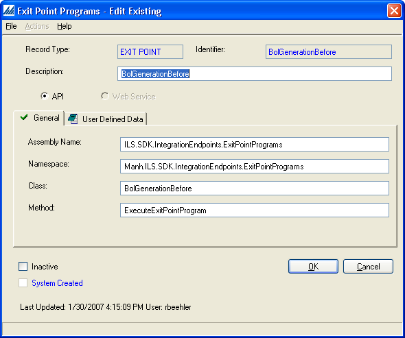

    

        
    

    

        
            
Manhattan Active SCALE Documentation

        

Integration Endpoints

    

    

         
                <label class="i-collapse-all" data-source-node="n39">Collapse All</label>
                <label class="i-expand-all" data-source-node="n40">Expand All</label>
            
        <a class="i-page-link i-view-in-frame-link" title="Open this Topic in a view that includes Navigation tools (Table of Contents, Index, Search)" data-source-node="n41">View with Navigation Tools</a>
    

    
    
    
    

        
Integration Endpoints refer to configurable extensions to the typical Manhattan SCALE system. These can be required components, such as Document Generators, where the base system ships and uses many different endpoints. They can also be optional components, such as Exit Points, that are used by consultants and/or customers to enhance the default functionality of the application to meet a specific business need. The application currently supports Integration Endpoints of the API types.

 

NOTE: In the application Integration Endpoints can be found under the Integration Services Folder of the Configuration Explorer.

     API Endpoints

    
API Integration Endpoints are written in any .NET language and are invoked in the same process as the consuming Manhattan SCALE logic. Except where noted, you must configure the assembly's name, the namespace, the class name, and the entry method of the endpoint from the appropriate Integration Endpoint configuration (e.g. the Exit Point Program config). At runtime, the application loads the assembly from the GAC, creates an instance of the configured class, and uses reflection to invoke the endpoint's entry method.

    
 

    
Here is an example of an Exit Point Program API configuration.

    
 

    

    
 

    
API style Integration Endpoints can throw an exception derived from Manh.ILS.General.IntegrationEndpointException of the WMW.General assembly. These exceptions can be used to:

    <ul data-source-node="n59">
        <li data-source-node="n60">Return validation errors via IntegrationEndpointException.Message.</li>

        <li data-source-node="n61">Wrap other caught exceptions via the IntegrationEndpointException.InnerException to prevent an unexpected abort in the business process.</li>
    </ul>

    
Note that the action taken once the IntegrationEndpointException is caught entirely depends on the business process, so please consult the each specific Integration Endpoint’s documentation for details.

            
            
        
    

    

        

 

 

©2026 Manhattan Associates. All Rights Reserved.

    

    

    
    
    
