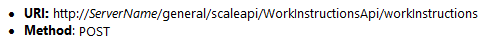
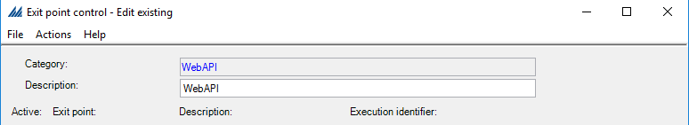
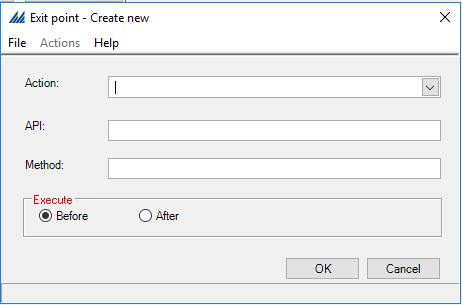
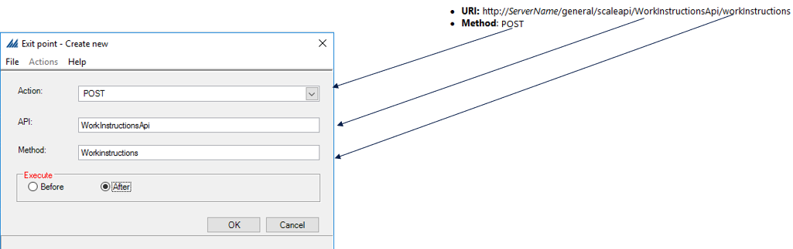

    

        
    

    

        
            
Manhattan Active SCALE Documentation

        

How To Add Web API Exit Point

    

    

         
                <label class="i-collapse-all" data-source-node="n39">Collapse All</label>
                <label class="i-expand-all" data-source-node="n40">Expand All</label>
            
        <a class="i-page-link i-view-in-frame-link" title="Open this Topic in a view that includes Navigation tools (Table of Contents, Index, Search)" data-source-node="n41">View with Navigation Tools</a>
    

    
<table data-source-node="n43"><tr data-source-node="n44"><td data-source-node="n45">
Extensibility
 &gt; <a href="5ca8e3aeb921ac3e1bb345accd1188f2811a2c37334fe414d5fa0022aa51ee08.html" data-source-node="n46">Web API Exit Point</a>
 &gt; How To Add Web API Exit Point</td></tr></table>

    
    
    

        

       

    
Web API Exit Point needs to add before configuring the exit point.

     Steps to Add Web API Exit Point

    Needs to follow the below steps to add an Exit Point for a Web API. In below example we are adding exit point for <b data-source-node="n55">WorkInstructionsApi</b> API.

    
- Get the URI from SDK for this API.

    
 

    

    
-Go to SCALE  Exit Point Control configuration screen . Open Exit Point Control for <b data-source-node="n61">WebAPI</b> category.

    
 

    

    
-Click on "Actions" from above screen. On  "Add Exit Point" selection below screen will display.

    
 

    

    
-Select "Action" and enter the "API", "Method"  as mentioned in URI .

    
For the above API Action should be <b data-source-node="n71">POST</b>, API <b data-source-node="n72">WorkInstructionsApi</b> and Method <b data-source-node="n73">workInstructions</b>

    
 

    
-Execute must be selected in case of <b data-source-node="n77">POST\PUT</b> action.

    
<strong data-source-node="n79">After</strong> must be selected in case Exit Point returns <strong data-source-node="n80">custom</strong> json along with API response.Otherwise <strong data-source-node="n81">Before</strong>  must be selected .

            
            
        
    

    

        

 

 

©2026 Manhattan Associates. All Rights Reserved.

    

    

    
    
    
