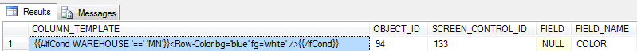

    

        
    

    

        
            
Manhattan Active SCALE Documentation

        

How to: Setup Colors on a Grid

    

    

         
                <label class="i-collapse-all" data-source-node="n39">Collapse All</label>
                <label class="i-expand-all" data-source-node="n40">Expand All</label>
            
        <a class="i-page-link i-view-in-frame-link" title="Open this Topic in a view that includes Navigation tools (Table of Contents, Index, Search)" data-source-node="n41">View with Navigation Tools</a>
    

    
<table data-source-node="n43"><tr data-source-node="n44"><td data-source-node="n45">
User Interface Extensibility
 &gt; Metadata Web Pages
 &gt; Shared
 &gt; How to: Setup Colors on a Grid</td></tr></table>

    
    
    

        
Adding a conditional statement in the COLUMN_TEMPLATE column of the SCREEN_CONTROL_GRID_COLUMNS table will provide a conditional color displayed on the grid when the conditions are met.

To setup a color on a grid, we first need to add a conditional statement into the COLUMN_TEMPLATE column. This conditional statement will be defined using the handlebar format and  will be stored in SCREEN_CONTROL_GRID_COLUMNS table. The condition will be checked when the datagrid is rendered. When the condition is satisfied, the color defined in the conditional statement will be displayed for each row meeting the condition.

 
Below is the screenshot showing the contents of SCREEN_CONTROL_GRID_COLUMNS table in which a conditional statement is added. The conditional statement in this screenshot is defined as: If the warehouse column of the grid is 'MN', then the background color of that grid row will be blue while the foreground color will be white.

 

 

The colors can be defined in hexadecimal format as well.  The above conditional statement can also be written as : If the warehouse column of the grid is 'MN', then the background color of that grid row will be <a style="WHITE-SPACE: normal;COLOR: rgb(64,64,64);BACKGROUND-COLOR: rgb(241,241,241)" href="http://www.w3schools.com/tags/ref_color_tryit.asp?hex=0000FF" data-source-node="n56">#0000FF</a> while the foreground color will be <a style="WHITE-SPACE: normal;COLOR: rgb(64,64,64);BACKGROUND-COLOR: rgb(255,255,255)" href="http://www.w3schools.com/tags/ref_color_tryit.asp?hex=FFFFFF" data-source-node="n57">#FFFFFF</a>. 

    <strong data-source-node="n59">NOTE:</strong> The Color column must be visible on the grid. Use the column chooser to verify the column is visible to ensure the colors are properly applied to the rows.

     Step 1: Determine the Object Id for the screen control - ListPaneDataGrid

    
Use the following SQL to determine the Object Id for the screen control name ListPaneDataGrid if you know the Form Id. The below example illustrates this to determine the Object Id for the scren control name ListPaneDataGrid if you know the form id represented as &lt;form id&gt; below. Insight Architect can also be used for this (<a href="9d1879df4946560f87a878505496d9ada1e9ac63368517e75e0d9428da242ec2.html" data-source-node="n66"><u data-source-node="n67">How to: Use Insight Architect to Customize a Metadata Page</u></a>).

    

        <table class="i-syntax-table" data-source-node="n70">
            <tbody data-source-node="n71">
                <tr data-source-node="n72">
                    <th data-source-node="n73">Find the Object Id for screen control</th>

                    <th data-source-node="n74">
                        

                            Copy Code
                        

                    </th>
                </tr>

                <tr data-source-node="n77">
                    <td class="i-code" colspan="2" data-source-node="n78">
                        <pre data-source-node="n79">
               SELECT OBJECT_ID FROM SCREEN_CONTROL WHERE SCREEN_GROUP_ID IN
                (SELECT OBJECT_ID FROM SCREEN_GROUP WHERE SCREEN_PART_ID IN  
                    (SELECT OBJECT_ID FROM SCREEN_PART WHERE SCREEN_ID IN
                        (SELECT OBJECT_ID FROM MAIN_UI_SCREEN WHERE FORM_ID=&lt;form id&gt;) AND PART_NAME='LISTPANE')
                             AND GROUP_NAME='LISTPANEPANEL')
</pre>
                    </td>
                </tr>
            </tbody>
        </table>
    

     Step 2: Update the value in Column_Template

    
Use the following SQL to update the value in the handlebar format. Update the column_template column in the SCREEN_CONTROL_GRID_COLUMNS table. The below example illustrates this for an insight listpane data grid. Insight Architect can also be used for this (<a href="9d1879df4946560f87a878505496d9ada1e9ac63368517e75e0d9428da242ec2.html" data-source-node="n114"><u data-source-node="n115">How to: Use Insight Architect to Customize a Metadata Page</u></a>).

    

        <table class="i-syntax-table" data-source-node="n118">
            <tbody data-source-node="n119">
                <tr data-source-node="n120">
                    <th data-source-node="n121">Update the  Column_Template</th>

                    <th data-source-node="n122">
                        

                            Copy Code
                        

                    </th>
                </tr>

                <tr data-source-node="n125">
                    <td class="i-code" colspan="2" data-source-node="n126">
                        <pre data-source-node="n127">
                
UPDATE SCREEN_CONTROL_GRID_COLUMNS SET
COLUMN_TEMPLATE='{{#ifCond WAREHOUSE ''=='' ''MN''}}&lt;Row-Color bg=''blue'' fg=''white'' /&gt;{{/ifCond}}' where FIELD_NAME='Color'
and SCREEN_CONTROL_ID= &lt;object id&gt;

Note :
bg--&gt; Indicates background color
fg--&gt; Indicates foreground color
</pre>
                    </td>
                </tr>
            </tbody>
        </table>
    

    
As a result of this SQL statement, grid rows that are assigned to warehouse MN would be highlighted with a blue background and a white foreground color.

    
 

    

        
For specific information on handlebars refer the following article: <a href="http://handlebarsjs.com/" data-source-node="n145"><u data-source-node="n146">http://handlebarsjs.com/</u></a>.

        
 

        
NOTE: %20 must be used for spaces for example CARRIER === UPS%20GROUND

    

    
 

    
<strong data-source-node="n152">NOTE:  The column of the grid used in conditional statement is case sensitive.</strong>

    
To determine the column value needed for a conditional statement, refer to the associated value found in the FIELD_NAME column of the SCREEN_CONTROL_GRID_COLUMNS table for the corresponding grid.

    

    
The below example illustrates this for a shipment header details grid.

    

        <table class="i-syntax-table" data-source-node="n159">
            <tbody data-source-node="n160">
                <tr data-source-node="n161">
                    <th data-source-node="n162">Update the  Column_Template</th>

                    <th data-source-node="n163">
                        

                            Copy Code
                        

                    </th>
                </tr>

                <tr data-source-node="n166">
                    <td class="i-code" colspan="2" data-source-node="n167">
                        <pre data-source-node="n168">
                
UPDATE SCREEN_CONTROL_GRID_COLUMNS SET
COLUMN_TEMPLATE='{{#ifCond QuantityUm ''=='' ''EA''}}&lt;Row-Color bg=''blue'' fg=''white'' /&gt;{{/ifCond}}' where FIELD_NAME='Color'
and SCREEN_CONTROL_ID= &lt;object id&gt;
</pre>
                    </td>
                </tr>
            </tbody>
        </table>
    

    
The below examples depict the occurance of multiple conditions. 

    

         Row color with muliple condition using AND
    

    

                       

        

            <table class="i-syntax-table" data-source-node="n187">
                <tbody data-source-node="n188">
                    <tr data-source-node="n189">
                        <th data-source-node="n190">C#</th>

                        <th data-source-node="n191">
                            

                                Copy Code
                            

                        </th>
                    </tr>

                    <tr data-source-node="n194">
                        <td class="i-code" colspan="2" data-source-node="n195">
                            <pre data-source-node="n196">
 if(warehouse=="MN" &amp;&amp; INVENTORY_STS=="Held")
 {
  Display Color;
 }
</pre>
                        </td>
                    </tr>
                </tbody>
            </table>
        

        
The above example can be written in the handlebar format as

        

            <table class="i-syntax-table" data-source-node="n202">
                <tbody data-source-node="n203">
                    <tr data-source-node="n204">
                        <th data-source-node="n205">Handlebar format</th>

                        <th data-source-node="n206">
                            

                                Copy Code
                            

                        </th>
                    </tr>

                    <tr data-source-node="n209">
                        <td class="i-code" colspan="2" data-source-node="n210">
                            <pre data-source-node="n211">
'{{#ifCond WAREHOUSE ''=='' ''LA''}}{{#ifCond INVENTORY_STS ''=='' ''Available''}}&lt;Row-Color bg=''blue'' fg=''white'' /&gt;{{/ifCond}}{{/ifCond}}'
</pre>
                        </td>
                    </tr>
                </tbody>
            </table>
        

    

    

         Row color with muliple condition using OR
    

    

                       

        

            <table class="i-syntax-table" data-source-node="n219">
                <tbody data-source-node="n220">
                    <tr data-source-node="n221">
                        <th data-source-node="n222">C#</th>

                        <th data-source-node="n223">
                            

                                Copy Code
                            

                        </th>
                    </tr>

                    <tr data-source-node="n226">
                        <td class="i-code" colspan="2" data-source-node="n227">
                            <pre data-source-node="n228">
 if(warehouse=="MN" || INVENTORY_STS=="Held")
 {
  Display Color;
 }
</pre>
                        </td>
                    </tr>
                </tbody>
            </table>
        

        
The above example can be written in the handlebar format as

        

            <table class="i-syntax-table" data-source-node="n234">
                <tbody data-source-node="n235">
                    <tr data-source-node="n236">
                        <th data-source-node="n237">Handlebar format</th>

                        <th data-source-node="n238">
                            

                                Copy Code
                            

                        </th>
                    </tr>

                    <tr data-source-node="n241">
                        <td class="i-code" colspan="2" data-source-node="n242">
                            <pre data-source-node="n243">
'{{#ifCond WAREHOUSE ''=='' ''MN''}}&lt;Row-Color bg=''blue'' fg=''white'' /&gt;{{/ifCond}}{{#ifCond INVENTORY_STS ''=='' ''Available''}}&lt;Row-Color bg=''blue'' fg=''white'' /&gt;{{/ifCond}}'
</pre>
                        </td>
                    </tr>
                </tbody>
            </table>
        

    

     Step 3: Refresh the Screen

    
Refresh the Insight screen to apply these changes

    

            
            
        
    

    

        

 

 

©2026 Manhattan Associates. All Rights Reserved.

    

    

    
    
    
