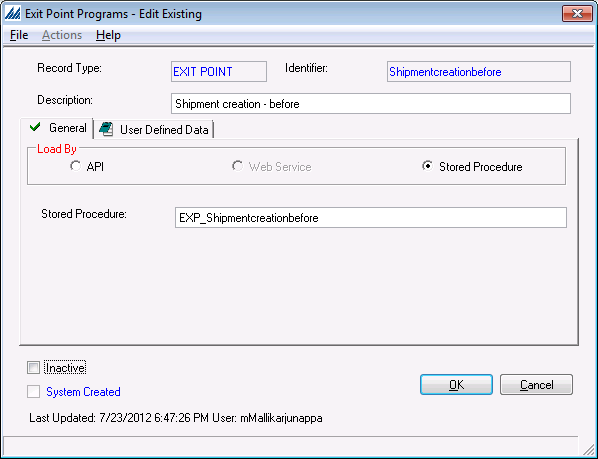
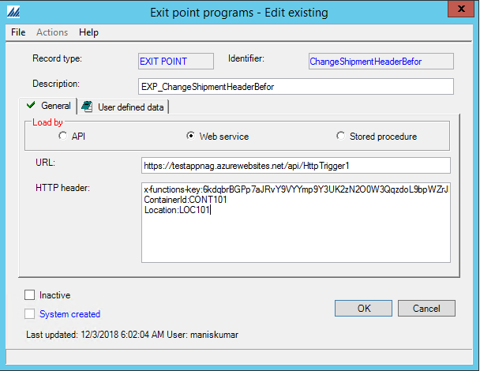

    

        
    

    

        
            
Manhattan Active SCALE Documentation

        

Exit Point Programs

    

    

         
                <label class="i-collapse-all" data-source-node="n39">Collapse All</label>
                <label class="i-expand-all" data-source-node="n40">Expand All</label>
            
        <a class="i-page-link i-view-in-frame-link" title="Open this Topic in a view that includes Navigation tools (Table of Contents, Index, Search)" data-source-node="n41">View with Navigation Tools</a>
    

    
<table data-source-node="n43"><tr data-source-node="n44"><td data-source-node="n45">
<a href="151fb685ffa48d0988636095b3af7881bab2d21e6ea0f1f1f260a337c40eebce.html" data-source-node="n46">Integration Endpoints</a>
 &gt; Exit Point Programs</td></tr></table>

    
    
    

        
Exit Point Programs are API style or SQL Stored Procedure type Integration Endpoints and are invoked during predefined checkpoints throughout the application. For the full details on each exit point, such as timing information, parameter lists, return values, and "Legacy" vs. IWorkFlowStep implementation (see below), view the <a href="../source/downloads/80f19d0a6ae470e375fd667c26b5853375417e18471c033f6c9c379942e5c258.xlsx" data-source-node="n49">Exit Point Program Details (Microsoft Excel)</a>.

For specific Exit Point Program samples, please view the <a href="b94690d0086cce4a01564186f37d44ebb01e1c357c251d8dcc0733889592653a.html" data-source-node="n51">Manh.ILS.SDK.IntegrationEndpoints.ExitPointPrograms Namespace</a>.

 

     API Type

    

         "Legacy" Programs
    

    

        
Exit Points that were created before the 2004R2 release will expect programs that implement the Manh.SDK.IntegrationEndpoints.ExitPointPrograms.ILegacyExitPointProgram. Please view the documentation on that interface and any implementing samples supplied with this SDK for more information on these style of Exit Point Programs.

        
Here is a simple example of an implementer of ILegacyExitPointProgram:

        

            <table class="i-syntax-table" data-source-node="n66">
                <tbody data-source-node="n67">
                    <tr data-source-node="n68">
                        <th data-source-node="n69">C#</th>

                        <th data-source-node="n70">
                            

                                Copy Code
                            

                        </th>
                    </tr>

                    <tr data-source-node="n73">
                        <td class="i-code" colspan="2" data-source-node="n74">
                            <pre data-source-node="n75">
public class SampleLegacyExitPointProgram : ILegacyExitPointProgram
{
    public object ExecuteExitPointProgram(
        string sessionString,
        object parameter1,
        object parameter2,
        object parameter3,
        object parameter4,
        object parameter5,
        object parameter6,
        object parameter7,
        object parameter8,
        object parameter9,
        object parameter10,
        object parameter11,
        object parameter12,
        object parameter13,
        object parameter14,
        object parameter15)
    {
        using (Session session = SessionMapper.ConvertFromLegacySession(sessionString))
        {

            // Insert Exit Point Program logic here.

        }

        return null;
    }
}
</pre>
                        </td>
                    </tr>
                </tbody>
            </table>
        

    

    
 

    

         IWorkFlowStep Programs
    

    

        
Since 2004R2, we have adopted a new approach to supporting exit points in the application. The new approach conforms with the "Strategy" design pattern. This means that the exit point program must implement the interface IWorkFlowStep (WMW.General.dll). Also, every custom program must be in a separate class but can be in the same assembly. 
         
        Here is a simple example of an implementer of IWorkFlowStep.

        
 

        

            <table class="i-syntax-table" data-source-node="n111">
                <tbody data-source-node="n112">
                    <tr data-source-node="n113">
                        <th data-source-node="n114">C#</th>

                        <th data-source-node="n115">
                            

                                Copy Code
                            

                        </th>
                    </tr>

                    <tr data-source-node="n118">
                        <td class="i-code" colspan="2" data-source-node="n119">
                            <pre data-source-node="n120">
public class SampleExitPointProgram : Manh.WMW.General.IWorkFlowStep
{
    public object ExecuteStep(
        Manh.WMFW.General.Session session,
        params object[] parameters)
    {

        // Insert Exit Point Program logic here.

        return null;
    }
}
</pre>
                        </td>
                    </tr>
                </tbody>
            </table>
        

        
When an Exit Point is triggered, the WorkFlowManager class queries the Exit Point Control &amp; Exit Point Program configuration for the exit point. If the exit point is active, it loads the assembly and creates an instance of the class of type IWorkFlowStep as defined in Exit Point Program. It then calls the ExecuteStep method on the interface. This runs the custom code.

    

     Stored Procedure Type

    
SQL Stored procedures are also supported as exit point programs. However the stored procedures need to conform to the following guidelines:-

    <ol data-source-node="n137">
        <li data-source-node="n138">The SP parameters should conform to the specification for the Exit point in terms of data type and parameter ordering. This is visible from the "Parameters List" screen on the Exit Point Control configuration.</li>

        <li data-source-node="n139">The "Exit Point Stored Procedure" screen can be used to generate correctly structured skeleton stored procedures for each exit point. Pre-existing stored procedures can also be modified by replacing "Create Procedure" with "Alter procedure" in the generated SQL (screen validations block all other freeform SQL)</li>

        <li data-source-node="n140">Return values from exit point programs are supported through "output" parameters. These are analogous to the API method return values or reference parameters. Note that such parameters in Sql Server allow both input and output.</li>

        <li data-source-node="n141">Complex parameter types like entities, class and array/collection types etc are serialized and sent as XML to stored procedures</li>

        <li data-source-node="n142">Utility SQL functions and stored procedures have been provided to allow easy extraction of data from XML parameters. More information can be found at <a href="879afe4dcf58a259a0b8942dd629c61fa833f4c9fd76dfdde8bce54fa1fa8311.html" data-source-node="n143">How to: Extract values from Xml through SQL</a></li>
    </ol>

    
 

    
An Exit point can be linked up with a stored procedure as in the screenshot below. For more details please refer Help documentation.

    

     Web Service Type

    
Azure Functions  are also supported as exit point programs. However the Azure Functions need to conform to the following guidelines:-

    <ol data-source-node="n154">
        <li data-source-node="n155">The Azure function URL should be a valid Azure Function URL.</li>

        <li data-source-node="n156">HTTP Header should be sent in proper format.</li>

        <li data-source-node="n157">This is HTTP POST web Service Call. This can be used to call an azure function or any web service.</li>

        <li data-source-node="n158">Parameters can be sent in HTTP Header in key-value pair with a semi-colon and multiple values supported on multiple lines.</li>

        <li data-source-node="n159">Any authentication is not supported while calling either azure function or web service.</li>

        <li data-source-node="n160">The response will be in string format which will be returned to the calling function.</li>
    </ol>

    
 

    
An Exit point can be linked up with a web service type as in the screenshot below. For more details please refer Help documentation.

    

     Invoking exit points in a transaction scope

    
Certain exit points are triggered from business processes that execute in a transaction and all data changes are supposed to be committed or rolled back at the logical end of the process. To ensure that changes made to the data in the custom exit point logic are persisted properly and to avoid stale data issues in the invoking base logic, the following guidelines are recommended.

    <ol data-source-node="n171">
        <li data-source-node="n172">The persistence technology used in the custom exit point should match the one used by the invoking module in the base application. Example: Close Container process uses NHibernate, hence the "Close Container - After" exit point should use the same.</li>

        <li data-source-node="n173">If the process executes in a transaction, the exit point should make related data updates in the same transaction and the application would perform the final commit or rollback as needed.  Any data changes made outside the transaction scope cannot be rolled-back by the application in case of a process failure; hence this scenario is not supported.</li>

        <li data-source-node="n174">"Stored Procedure" exit point programs are invoked in a new database transaction scope. It does not commit/rollback in the same transaction as the EntityBroker/NHibernate transaction (if any) of the calling process.</li>
    </ol>

    
 

    
The <a href="../source/downloads/80f19d0a6ae470e375fd667c26b5853375417e18471c033f6c9c379942e5c258.xlsx" data-source-node="n177">Exit Point Program Details (Microsoft Excel)</a> document indicates which exit points need to be invoked within a transaction scope and the persistence technology used in the invoking application module.

     Client Side Exit points

    
The following client-side Exit Point programs that previously existed in the SCALE desktop application have not been recreated in the SCALE metadata web pages. Instead, each one can still be accomplished through metadata or Javascript or Typescript changes as noted below.     

    
       

    <table data-source-node="n185">
        <tbody data-source-node="n186">
            <tr valign="top" data-source-node="n187">
                <th height="9" data-source-node="n188">Exit Point</th>

                <th height="9" data-source-node="n189">Desktop Screen</th>

                <th height="9" data-source-node="n190">Metadata screen</th>

                <th height="9" data-source-node="n191">Exit point Implementation in Metadata Screen</th>
            </tr>

            <tr data-source-node="n192">
                <td data-source-node="n193">Before- cycle count reconcile</td>

                <td data-source-node="n194">Cycle count reconciliation</td>

                <td data-source-node="n195">Cycle count reconciliation</td>

                <td data-source-node="n196">If the "Before- cycle count reconcile" exit point was previously utilized on the full screen cycle count reconciliation screen, and you want to do something similar in the web metadata version of cycle count reconciliation screen, then create new web service with your requirement and modify the $(window).load function present in manh.ui.cycleCountReconciliationTransaction.js to invoke the web service you have created.</td>
            </tr>

            <tr data-source-node="n197">
                <td data-source-node="n198">Suggest Value in Cycle Count Reconciliation</td>

                <td data-source-node="n199">Cycle count reconciliation</td>

                <td data-source-node="n200">Cycle count reconciliation</td>

                <td data-source-node="n201">If the "Suggest Value in Cycle Count Reconciliation" exit point was previously utilized on the full screen cycle count reconciliation screen, and you want to do something similar in the web metadata version of cycle count reconciliation screen, then modify the $(window).load function present in manh.ui.cycleCountReconciliationTransaction.js to set the required value to the input control id “ReconcileSetOnHandQuantity”.</td>
            </tr>

            <tr data-source-node="n202">
                <td data-source-node="n203">QC Workbench - Count Before</td>

                <td data-source-node="n204">QC workbench</td>

                <td data-source-node="n205">QC workbench</td>

                <td data-source-node="n206">If the "QC Workbench - Count Before" exit point was previously utlized on the full screen QC workbench, and you want to do something similar in the web metadata version of QC workbench, then modify the itemEditorChanged function present in the shippingContainerQC.component.ts file or add your own custom function and configure the event to call the new method.</td>
            </tr>

            <tr data-source-node="n207">
                <td data-source-node="n208">QC Workbench - Leave Item</td>

                <td data-source-node="n209">QC workbench</td>

                <td data-source-node="n210">QC workbench</td>

                <td data-source-node="n211">if you used to use the "leave item" exit point on QC workbench in full screen, and you want to do something similar in the web metadata version of QC workbench, we need to add exit point code in countQc method present in shippingContainerQC.component.ts file</td>
            </tr>
        </tbody>
    </table>           

     Exit points invoked from warehouse mobile

    
The following is the list of exit points invoked from the warehouse mobile APIs.

    <innovasys:widgetproperty layout="block" name="Content" data-source-node="n218">
        

             General
        

        

            <table data-source-node="n224">
                <thead data-source-node="n225">
                    <tr data-source-node="n226">
                        <th data-source-node="n227">Exit point</th>

                        <th data-source-node="n228">Description</th>
                    </tr>
                </thead>

                <tbody data-source-node="n229">
                    <tr data-source-node="n230">
                        <td data-source-node="n231">Adjustment Type Authorization Retrieval</td>

                        <td data-source-node="n232">Modifies adjustment type list as per authorization</td>
                    </tr>

                    <tr data-source-node="n233">
                        <td data-source-node="n234">Cycle Count Reconcile - After</td>

                        <td data-source-node="n235">After a cycle count reconcile</td>
                    </tr>

                    <tr data-source-node="n236">
                        <td data-source-node="n237">Cycle Count SQL - Modify</td>

                        <td data-source-node="n238">Cycle Count SQL - Modify</td>
                    </tr>

                    <tr data-source-node="n239">
                        <td data-source-node="n240">Finished Item SN Validation</td>

                        <td data-source-node="n241">Finished Item SN Validation</td>
                    </tr>

                    <tr data-source-node="n242">
                        <td data-source-node="n243">Image capture - Update company</td>

                        <td data-source-node="n244">Image capture - Update company</td>
                    </tr>

                    <tr data-source-node="n245">
                        <td data-source-node="n246">Image capture - Link internal reference number</td>

                        <td data-source-node="n247">Image capture - Link internal reference number</td>
                    </tr>

                    <tr data-source-node="n248">
                        <td data-source-node="n249">Inv Mgmt Validation - After</td>

                        <td data-source-node="n250">Inv Mgmt Validation - After</td>
                    </tr>

                    <tr data-source-node="n251">
                        <td data-source-node="n252">Inventory Transaction - After</td>

                        <td data-source-node="n253">Inventory Transaction - After</td>
                    </tr>

                    <tr data-source-node="n254">
                        <td data-source-node="n255">Item Validation Get Cross Reference SQL - Modify</td>

                        <td data-source-node="n256">Item Validation Get Cross Reference SQL - Modify</td>
                    </tr>

                    <tr data-source-node="n257">
                        <td data-source-node="n258">Labor Management Log Request - After</td>

                        <td data-source-node="n259">Labor Management Log Request - After</td>
                    </tr>

                    <tr data-source-node="n260">
                        <td data-source-node="n261">Labor Management Log Request - Before</td>

                        <td data-source-node="n262">Labor Management Log Request - Before</td>
                    </tr>

                    <tr data-source-node="n263">
                        <td data-source-node="n264">RF Work Replace Text Message Retrieval Logic</td>

                        <td data-source-node="n265">RF Work Replace Text Message Retrieval Logic</td>
                    </tr>

                    <tr data-source-node="n266">
                        <td data-source-node="n267">WM Capture inventory attributes</td>

                        <td data-source-node="n268">WM Capture inventory attributes</td>
                    </tr>

                    <tr data-source-node="n269">
                        <td data-source-node="n270">WM SRC Configurator - Override</td>

                        <td data-source-node="n271">WM SRC Configurator - Override</td>
                    </tr>

                    <tr data-source-node="n272">
                        <td data-source-node="n273">Work Creation - After</td>

                        <td data-source-node="n274">Work Creation - After</td>
                    </tr>

                    <tr data-source-node="n275">
                        <td data-source-node="n276">Work Creation - Before</td>

                        <td data-source-node="n277">Work Creation - Before</td>
                    </tr>

                    <tr data-source-node="n278">
                        <td data-source-node="n279">Work Order Header Allocation - Before</td>

                        <td data-source-node="n280">Work Order Header Allocation - Before</td>
                    </tr>

                    <tr data-source-node="n281">
                        <td data-source-node="n282">Work Profile Authorization Retrieval</td>

                        <td data-source-node="n283">Modifies work profile list as per authorization</td>
                    </tr>
                </tbody>
            </table>
        

        

             Inbound
        

        

            <table data-source-node="n289">
                <thead data-source-node="n290">
                    <tr data-source-node="n291">
                        <th data-source-node="n292">Exit point</th>

                        <th data-source-node="n293">Description</th>
                    </tr>
                </thead>

                <tbody data-source-node="n294">
                    <tr data-source-node="n295">
                        <td data-source-node="n296">Check In - Before</td>

                        <td data-source-node="n297">Check In - Before</td>
                    </tr>

                    <tr data-source-node="n298">
                        <td data-source-node="n299">Check In - Lot Entry Expiration Date Validation</td>

                        <td data-source-node="n300">Validates expiration date when specified</td>
                    </tr>

                    <tr data-source-node="n301">
                        <td data-source-node="n302">Check In Inv Attributes Assignment - Replace</td>

                        <td data-source-node="n303">Check In Inv Attributes Assignment - Replace</td>
                    </tr>

                    <tr data-source-node="n304">
                        <td data-source-node="n305">Close Receipt - Before</td>

                        <td data-source-node="n306">Close Receipt - Before</td>
                    </tr>

                    <tr data-source-node="n307">
                        <td data-source-node="n308">Locate - Before</td>

                        <td data-source-node="n309">Locate - Before</td>
                    </tr>

                    <tr data-source-node="n310">
                        <td data-source-node="n311">Locating Location Selection SQL - Modify</td>

                        <td data-source-node="n312">Locating Location Selection SQL - Modify</td>
                    </tr>

                    <tr data-source-node="n313">
                        <td data-source-node="n314">Locating Request - After</td>

                        <td data-source-node="n315">Locating Request - After</td>
                    </tr>

                    <tr data-source-node="n316">
                        <td data-source-node="n317">Locating Rule Split - Override</td>

                        <td data-source-node="n318">Locating Rule Split - Override</td>
                    </tr>

                    <tr data-source-node="n319">
                        <td data-source-node="n320">Override Inbound QC Values</td>

                        <td data-source-node="n321">Override Inbound QC Values</td>
                    </tr>

                    <tr data-source-node="n322">
                        <td data-source-node="n323">Override Putaway Group Selection SQL</td>

                        <td data-source-node="n324">Override Putaway Group Selection SQL</td>
                    </tr>

                    <tr data-source-node="n325">
                        <td data-source-node="n326">Pre Check Receipt Container Id - Replace</td>

                        <td data-source-node="n327">Pre Check Receipt Container Id - Replace</td>
                    </tr>

                    <tr data-source-node="n328">
                        <td data-source-node="n329">Putaway Group Close - Before</td>

                        <td data-source-node="n330">Putaway Group Close - Before</td>
                    </tr>

                    <tr data-source-node="n331">
                        <td data-source-node="n332">Receiving Preference Authorization Retrieval</td>

                        <td data-source-node="n333">Modifies receiving preference list as per authoriz</td>
                    </tr>

                    <tr data-source-node="n334">
                        <td data-source-node="n335">Receiving- Validate Immediate Needs Request</td>

                        <td data-source-node="n336">Validate immediate needs request during receiving</td>
                    </tr>
                </tbody>
            </table>
        

        

             Outbound
        

        

            <table data-source-node="n342">
                <thead data-source-node="n343">
                    <tr data-source-node="n344">
                        <th data-source-node="n345">Exit point</th>

                        <th data-source-node="n346">Description</th>
                    </tr>
                </thead>

                <tbody data-source-node="n347">
                    <tr data-source-node="n348">
                        <td data-source-node="n349">Close Container - After</td>

                        <td data-source-node="n350">Close Container - After</td>
                    </tr>

                    <tr data-source-node="n351">
                        <td data-source-node="n352">Close Container - Validate</td>

                        <td data-source-node="n353">Close Container - Validate</td>
                    </tr>

                    <tr data-source-node="n354">
                        <td data-source-node="n355">Container Type Authorization Retrieval</td>

                        <td data-source-node="n356">Modifies container type list as per authorization</td>
                    </tr>

                    <tr data-source-node="n357">
                        <td data-source-node="n358">Delete Shipment - After</td>

                        <td data-source-node="n359">Delete Shipment - After</td>
                    </tr>

                    <tr data-source-node="n360">
                        <td data-source-node="n361">Delete Shipment - Before</td>

                        <td data-source-node="n362">Delete Shipment - Before</td>
                    </tr>

                    <tr data-source-node="n363">
                        <td data-source-node="n364">Group Pick Instructions - Override</td>

                        <td data-source-node="n365">Group Pick Instructions - Override</td>
                    </tr>

                    <tr data-source-node="n366">
                        <td data-source-node="n367">Immediate Dock Transfer - Before</td>

                        <td data-source-node="n368">Immediate Dock Transfer - Before</td>
                    </tr>

                    <tr data-source-node="n369">
                        <td data-source-node="n370">Multi Order Pallet Container ID - Replace</td>

                        <td data-source-node="n371">Multi Order Pallet Container ID Replace</td>
                    </tr>

                    <tr data-source-node="n372">
                        <td data-source-node="n373">Replenishment Existing Inv Calc SQL - Modify</td>

                        <td data-source-node="n374">Replenishment Existing Inv Calc SQL - Modify</td>
                    </tr>

                    <tr data-source-node="n375">
                        <td data-source-node="n376">RF Serial Number Scan - Before</td>

                        <td data-source-node="n377">RF Serial Number Scan - Before</td>
                    </tr>

                    <tr data-source-node="n378">
                        <td data-source-node="n379">Shipment Work Instruction - Close</td>

                        <td data-source-node="n380">Shipment Work Instruction - Close</td>
                    </tr>

                    <tr data-source-node="n381">
                        <td data-source-node="n382">Short Pick Inventory - Replace?</td>

                        <td data-source-node="n383">Short Pick Inventory - Replace?</td>
                    </tr>

                    <tr data-source-node="n384">
                        <td data-source-node="n385">Work Short Pick - After</td>

                        <td data-source-node="n386">Work Short Pick - After</td>
                    </tr>

                    <tr data-source-node="n387">
                        <td data-source-node="n388">Work Unit Close</td>

                        <td data-source-node="n389">Work Unit Close</td>
                    </tr>
                </tbody>
            </table>
        

    </innovasys:widgetproperty>

            
            
        
    

    

        

 

 

©2026 Manhattan Associates. All Rights Reserved.

    

    

    
    
    
