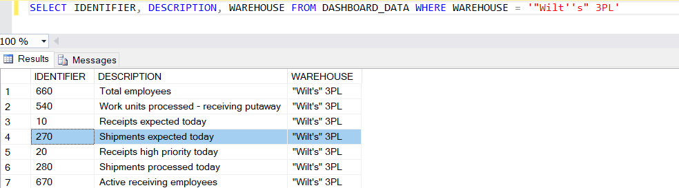
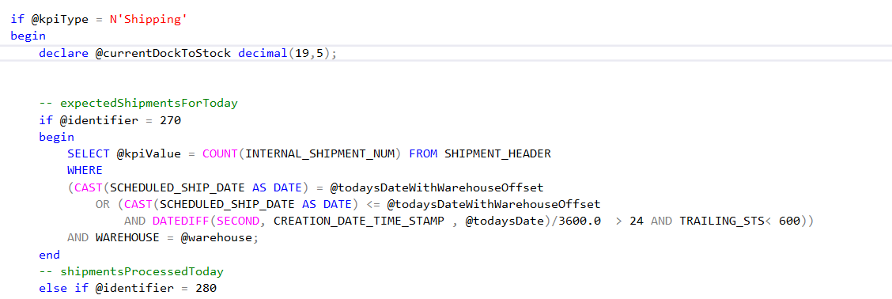

    

        
    

    

        
            
Manhattan Active SCALE Documentation

        

How to: Customize the Dashboard KPI Calculations

    

    

         
                <label class="i-collapse-all" data-source-node="n39">Collapse All</label>
                <label class="i-expand-all" data-source-node="n40">Expand All</label>
            
        <a class="i-page-link i-view-in-frame-link" title="Open this Topic in a view that includes Navigation tools (Table of Contents, Index, Search)" data-source-node="n41">View with Navigation Tools</a>
    

    
<table data-source-node="n43"><tr data-source-node="n44"><td data-source-node="n45">
User Interface Extensibility
 &gt; Metadata Web Pages
 &gt; Transaction Pages
 &gt; How to: Customize the Dashboard KPI Calculations</td></tr></table>

    
    
    

        
This topic will walk you through customizing the Key Performance Indicator(KPI) calculations of Dashboard screen. All widgets of Dashboard make separate API calls to fetch the data and API's intern make call to one single stored procedure DASH_GetKPIData by passing the required parameters. The DASH_GetKPIData procedure internally invokes an function DASHFn_GetKPIValue which holds all KPI's calcuation logic. Steps to customize KPI calculations are as follows.

     Step 1: Find out the Identifier of the KPI to be modified

    

        After accessing the dashboard screen for first time system inserts all KPI records into DASHBOARD_DATA table. Query the DASHBOARD_DATA table and find out the identifier of the KPI to be modified as show below
    

    

         
    

    

    

    

     Step 2: Modify the KPI calculation in DASHFn_GetKPIValue SQL function

    

        Search for the identifier of the KPI to be modified in DASHFn_GetKPIValue SQL function and customize the query as required.
    

    

    

    

    

        For customizing the Today's Receipts By Time and Today's Shipments By Time calculations modify the queries in DASH_CaptureDashboardData stored procedure.
    

            
            
        
    

    

        

 

 

©2026 Manhattan Associates. All Rights Reserved.

    

    

    
    
    
