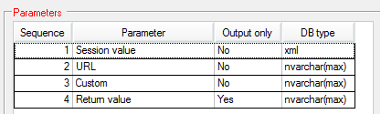

    

        
    

    

        
            
Manhattan Active SCALE Documentation

        

Web API Exit Point

    

    

         
                <label class="i-collapse-all" data-source-node="n39">Collapse All</label>
                <label class="i-expand-all" data-source-node="n40">Expand All</label>
            
        <a class="i-page-link i-view-in-frame-link" title="Open this Topic in a view that includes Navigation tools (Table of Contents, Index, Search)" data-source-node="n41">View with Navigation Tools</a>
    

    
<table data-source-node="n43"><tr data-source-node="n44"><td data-source-node="n45">
Extensibility
 &gt; Web API Exit Point</td></tr></table>

    
    
    

        
Extensibility added to invoke the Exit Point before\after Web API action execution.

 

<ul data-source-node="n49">
    <li data-source-node="n50">Exit Point category <b data-source-node="n51">WebAPI</b> added.</li>

    <li data-source-node="n52">Web API exit point parameters are shown as below.

        
 

    </li>

    <li data-source-node="n55">Web API exit point <b data-source-node="n56">Return value</b> must be serialized json object or null.</li>

    <li data-source-node="n57">Web API response contains the Exit point return value inside the "custom" attribute.</li>
</ul>
            
            
        
    

    

        

 

 

©2026 Manhattan Associates. All Rights Reserved.

    

    

    
    
    
