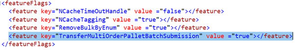
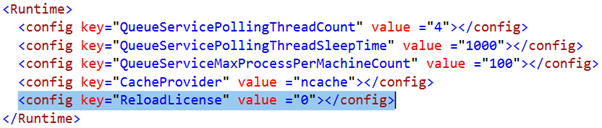

    

        
    

    

        
            
Manhattan Active SCALE Documentation

        

Feature flags and runtime settings

    

    

         
                <label class="i-collapse-all" data-source-node="n39">Collapse All</label>
                <label class="i-expand-all" data-source-node="n40">Expand All</label>
            
        <a class="i-page-link i-view-in-frame-link" title="Open this Topic in a view that includes Navigation tools (Table of Contents, Index, Search)" data-source-node="n41">View with Navigation Tools</a>
    

    
<table data-source-node="n43"><tr data-source-node="n44"><td data-source-node="n45">
Implementation Overriding
 &gt; Feature flags and runtime settings</td></tr></table>

    
    
    

        

     System level feature flags

    
System level Feature flags are defined in the “FeatureFlags.xml” file and they can be found in the “Settings” folder of the Manhattan SCALE application servers.

    <ol data-source-node="n53">
        <li data-source-node="n54">Defines the list of features that the system is supporting.</li>

        <li data-source-node="n55">Features can be turned on/off using these settings.</li>
    </ol>

    
<b data-source-node="n57">Example:</b>

    
Transferring a Multiple Order Pallet (MOP), containing many shipping containers takes more time. This process can be submitted to batch by turning on (setting to “true”) the feature “TransferMultiOrderPalletBatchSubmission”.

    

     Run time settings:

    
Run time settings can be defined in the “Runtime.xml” file and can be found in the “Settings” folder of the Manhattan SCALE application servers.

    <ol data-source-node="n67">
        <li data-source-node="n68">Defines a list of settings that impact the changes dynamically.</li>

        <li data-source-node="n69">Changes will be impacted without being resetting the services.</li>
    </ol>

    
<b data-source-node="n71">Example:</b>

    
Whenever a license is added/changed, changing the value of the below highlighted key (ReloadLicense) will reload the license into the system without the need of resetting the services.

    

            
            
        
    

    

        

 

 

©2026 Manhattan Associates. All Rights Reserved.

    

    

    
    
    
