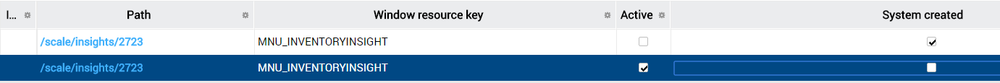

    

        
    

    

        
            
Manhattan Active SCALE Documentation

        

How to: Use Insight Architect to Customize a Metadata Page 

    

    

         
                <label class="i-collapse-all" data-source-node="n39">Collapse All</label>
                <label class="i-expand-all" data-source-node="n40">Expand All</label>
            
        <a class="i-page-link i-view-in-frame-link" title="Open this Topic in a view that includes Navigation tools (Table of Contents, Index, Search)" data-source-node="n41">View with Navigation Tools</a>
    

    
<table data-source-node="n43"><tr data-source-node="n44"><td data-source-node="n45">
User Interface Extensibility
 &gt; Metadata Web Pages
 &gt; Extensibility Tooling
 &gt; How to: Use Insight Architect to Customize a Metadata Page </td></tr></table>

    
    
    

        
Insight Architect is a tool used to customize metadata. Currently Insight Architect is a simple editing of raw metadata. This means that it exactly follows the database flow and structure for metadata tables and allows for updating literal database values. For a review on the metadata architecture please reference the <a href="2947132cd4956ea18b05a31ba95ea4781245188fab631288551ad3e8094e543a.html" data-source-node="n48">Metadata Page Architecture</a> topic. Some benefits of using Insight Architect over straight SQL include:

<ul data-source-node="n49">
    <li data-source-node="n50">Easier traversing of the metadata hierarchy</li>

    <li data-source-node="n51">Selection from lists where applicable</li>

    <li data-source-node="n52">Automatic clearing of cached metadata for immediate results</li>

    <li data-source-node="n53">Ability to export versioned scripts for screen metadata</li>
</ul>

Follow these instructions to use Insight Architect to customize metadata.

     Step 1: Create a Customized Version of the Screen

    
Make sure that there is a customized version of the desired screen by following the instructions in the Developer Hub topic.

     Step 2: Browse to the Appropriate Insight Architect Page

    
Insight Architect is not available from the main menu on the metadata web pages. Therefore, to access it, you need to manually type the appropriate URL into your browser of choice. First, find the appropriate Form Id by reviewing the Desktop Layout configuration and finding the screen that you want to customize. With that Form Id, open a browser and type the following URL:

    
 

    
<strong data-source-node="n69">https://&lt;servername&gt;/scale/details/form/&lt;formid&gt;</strong>

     Step 3: Drill Down to the Customized Page

    
It is important to only customize the screen that is marked with system_created = N, otherwise the base installer will overwrite your customizations. Click on the hyperlink that has system_created = N (unchecked box).

    
 

    

     Step 4: Modify Metadata using Insight Architect

    
Traverse through the metadata hierarchy using Insight Architect by clicking the hyperlinks in the grids and then edit, delete, or create metadata records as required. For each metadata record, once editing or creating is complete on the page, click the Save button. This will automatically clear the metadata cache so that your changes can be immediately viewed from the actual page itself (or open the page by clicking the Preview button).
       

     Step 5: Export a Versioned Script

    At any point during metadata customization, you can save off a versioned script for the current screen metadata by clicking the Actions | Export button from the "Screen" Insight Architect page (URL mentioned above).

 

            
            
        
    

    

        

 

 

©2026 Manhattan Associates. All Rights Reserved.

    

    

    
    
    
