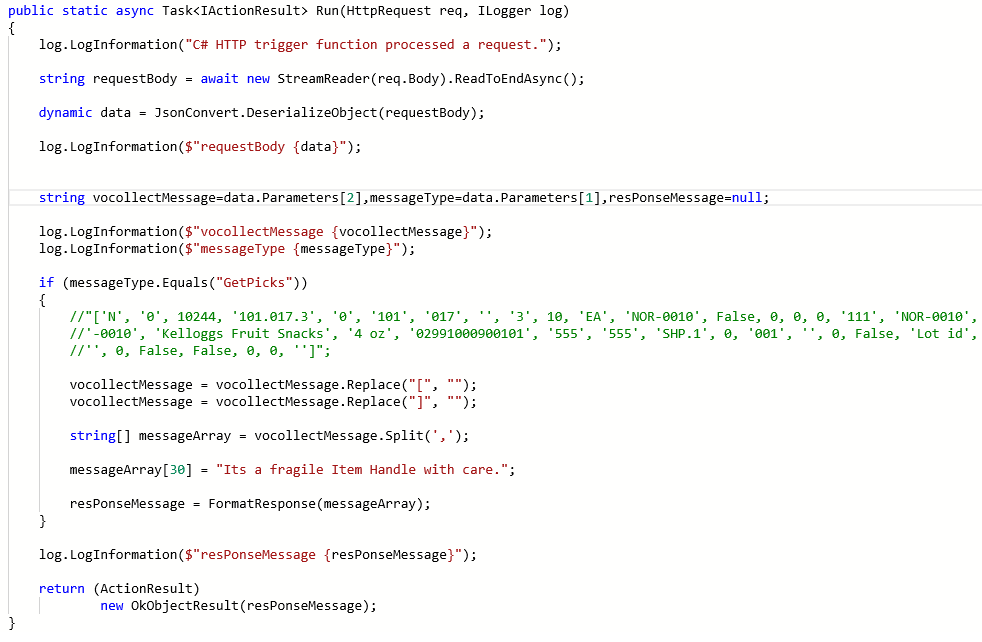

    

        
    

    

        
            
Manhattan Active SCALE Documentation

        

Exit Points For Customizing The Vocollect Request And Response Messages

    

    

         
                <label class="i-collapse-all" data-source-node="n39">Collapse All</label>
                <label class="i-expand-all" data-source-node="n40">Expand All</label>
            
        <a class="i-page-link i-view-in-frame-link" title="Open this Topic in a view that includes Navigation tools (Table of Contents, Index, Search)" data-source-node="n41">View with Navigation Tools</a>
    

    
<table data-source-node="n43"><tr data-source-node="n44"><td data-source-node="n45">
<a href="151fb685ffa48d0988636095b3af7881bab2d21e6ea0f1f1f260a337c40eebce.html" data-source-node="n46">Integration Endpoints</a>
 &gt; Exit points
 &gt; Exit Points For Customizing The Vocollect Request And Response Messages</td></tr></table>

    
    
    

        
The system provides following exit points for customizing the vocollect messages. These exit points are added in VocollectMessagesApi service. Right now this feature is provided only for Manhattan Active SCALE customers.

<ul data-source-node="n49">
    <li data-source-node="n50">Customize incoming Vocollect message – Before

        
This one is used to customize the vocollect request message before scale processing it.

    </li>

    <li data-source-node="n52">Customize outgoing Vocollect message – Before

        
This one is used to customize the vocollect response message before sending it from Scale to the vocollect device.

    </li>
</ul>

Both the exit points receive following four input parameters.

<ul data-source-node="n55">
    <li data-source-node="n56"><strong data-source-node="n57">Session value</strong></li>

    <li data-source-node="n58"><strong data-source-node="n59">Message type</strong> (Container, ContainerReview, ContainerType, CoreBreakTypes, CoreConfiguration, CoreSendBreakInfo, CoreSendVehicleIDs, CoreSignOff, CoreSignOn, CoreValidCodes, CoreValidFunctions, CoreValidVehicleTypes, GetAssignment, GetDeliveryLocation, GetPicks, PassAssignment, Picked, PickingRegion, Print, RegionPermissionsForWorkType, RequestWork, ReviewCasePicks, SendLot, StopAssignment, UpdateStatus, ValidLots, VerifyReplenishment, VerifyReplenishment)</li>

    <li data-source-node="n60"><strong data-source-node="n61">Vocollect message</strong> (in case of incoming ,it is a request message. for outgoing it is a response message.)</li>

    <li data-source-node="n62"><strong data-source-node="n63">Return value</strong> (Output only)</li>
</ul>

The following example(Azure function) represents a sample implementation of customizing the vocollect response message before sending it to the vocollect device.

 

<strong data-source-node="n67">Azure function</strong>

            
            
        
    

    

        

 

 

©2026 Manhattan Associates. All Rights Reserved.

    

    

    
    
    
