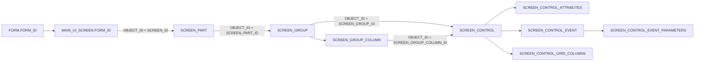

# Snapdragon database and configuration-form evidence

On 2 October 2026, the explicitly requested replica `travprodwbeyz` reported `READ_ONLY`. The collector reused existing private authentication material with that database name; it did not change the existing credential file or `tools/assess_db.py`.

The database capture and live configuration-form pass are distinct evidence. Database metadata identifies configured relationships. The browser pass confirms which specific Form records and linked Screens grids the current session can display. Neither establishes operational execution or configuration-save acceptance.

## Counts and denominators

| Measure | Result | Meaning |
|---|---:|---|
| FORM records | 917 | All form identities, including records without a main web screen |
| MAIN_UI_SCREEN records | 254 | Base/custom and active/inactive records are preserved |
| Unique FORM_IDs represented by MAIN_UI_SCREEN | 253 | Form 2735 has two screen records |
| Active MAIN_UI_SCREEN records / unique active-linked forms | 211 / 211 | Denominator for the configuration-form browser pass |
| Active-linked forms opened and inspected | 211/211, 100% | Matching heading, form key, table/view value, and loaded Screens grid |
| Forms with a visible expected main-screen ID hyperlink | 190/211 | The other 21 have a blank configured Path |
| Screens grid rows across the 211 inspected forms | 212 | Includes both Shipment Insight alternatives |
| Unique visible linked main-screen IDs | 191 | One inactive alternative is visible alongside its active replacement |
| Direct Insight/Monitor route candidates | 53 | 47 Insights and six Monitors; browser runtime observations are a separate register |

All 211 browser-observed form keys and table/view values matched the replica. Five initial accordion-animation problems were rechecked successfully using keyboard activation; earlier attempt details are retained in the receipt. The audit used only Form Properties and Screens. It did not open General/User Defined, edit values, select Add, select Save, or execute operations. Legacy records with blank Path still have a visible Screens row; no invisible main-screen ID was inferred from that row.

Form **2796**, Purchase Order Insight, maps to active system-created main screen **1776**, `/scale/insights/2796`, and `METADATA_INSIGHT_PURCHASE_ORDER_HEADER_VIEW`. Its configuration has six parts, 21 groups, 47 controls, 18 grid columns, 49 attributes, 29 events, and 63 event parameters.

Form **2735**, Shipment Insight, has active custom main screen **1621** (`SYSTEM_CREATED=N`) and inactive base main screen **1786** (`SYSTEM_CREATED=Y`). Treating FORM_ID as a unique screen-row key would lose this distinction.

## Structural map



The capture includes **463 parts, 1,872 groups, 4,949 controls, 54 group columns, 1,635 grid columns, 3,793 attributes, 1,767 events and 2,627 event parameters**. There are 1,860 controls with attributes, 1,552 controls with events, and 849 events with parameters. Attribute/control, event/control, parameter/event, and group-column/group joins have zero orphan rows in this snapshot. Parent-group and nested-group metadata are retained separately within the group records.

These records explain configurable structure and event relationships. They do not prove that a control is available to every user, licensed, visible in every state, invoked by a workflow, or safe to apply. Attribute/parameter values, data-source expressions, templates, action semantics, and operational effects require separate bounded review.

## Files and reproducibility

- [Screen registry](../inventory/screen-registry.json) and [CSV](../inventory/screen-registry.csv): original paths, candidate URLs, classification, configuration counts, and separate configuration-form inspection status. `route_verified_live` concerns the runtime route; the configuration-form evidence has its own fields.
- [Screen configuration index](SCREEN_CONFIGURATION_INDEX.md): readable 254-row overview.
- [Configuration chains](screen-configuration-chains.json): parts, groups, controls and grid-column metadata with English resource labels.
- [Interaction map](screen-interaction-map.json) and [summary](interaction-map-summary.json): attribute/event/parameter relationships by screen and control.
- [Current capture manifest](current-capture-manifest.json): exact SQL, query hashes, selected output hashes, row counts, and execution timestamps for 21 final capture artifacts. Historical phase manifests can refer to earlier identity/schema outputs; the current manifest selects their latest matching files.
- [Live Form audit](../evidence/config-form-navigation.json) and [summary](../evidence/config-form-navigation-summary.json): one receipt per active-linked FORM_ID.

Commands used, all with exit code **0** on final execution:

```powershell
python Snapdragon/tools/collect_navigation_metadata.py --phase schema
python Snapdragon/tools/collect_navigation_metadata.py --phase inventory
python Snapdragon/tools/collect_navigation_metadata.py --phase supplement
python Snapdragon/tools/collect_navigation_metadata.py --phase labels
python Snapdragon/tools/collect_navigation_metadata.py --phase graph-schema
python Snapdragon/tools/collect_navigation_metadata.py --phase graph
python Snapdragon/tools/build_navigation_inventory.py
python Snapdragon/tools/build_interaction_map.py
python -m py_compile Snapdragon/tools/collect_navigation_metadata.py Snapdragon/tools/build_navigation_inventory.py Snapdragon/tools/build_interaction_map.py
```

Collection is a fixed SELECT allowlist with TLS verification, read-only intent and bounded timeouts. It exposes no arbitrary SQL input. No transaction records, user security assignments, saved searches, user/process stamps, connection strings, or business-record values were captured. No DDL, DML, stored routine, configuration save, or operational action was run. Read-only connection intent is not itself an access-control guarantee; the replica's observed `READ_ONLY` status is retained separately.

The synced files omit 691 grid FIELD expressions and two non-token event values, retaining hashes and lengths; their raw source expressions remain in the existing private LOCALAPPDATA assessment area. Attribute and parameter values were **never returned by the database queries**: the outputs contain only SQL SHA-256 hashes over UTF-16LE bytes, byte lengths and selected relationship/flag metadata. Token-slot values were omitted. No arbitrary action parameter payload is included in the documentation.

Resource labels came from English base/custom resource records for known configuration keys. The readable map prefers a captured custom label when present; this does not establish every deployed resource-resolution rule. The `FUNCTIONAL_AREA` table returned Inbound/Outbound status-flow definitions, not the numeric main-menu area labels, so the inventory retains the numeric UI codes without inventing a join.
