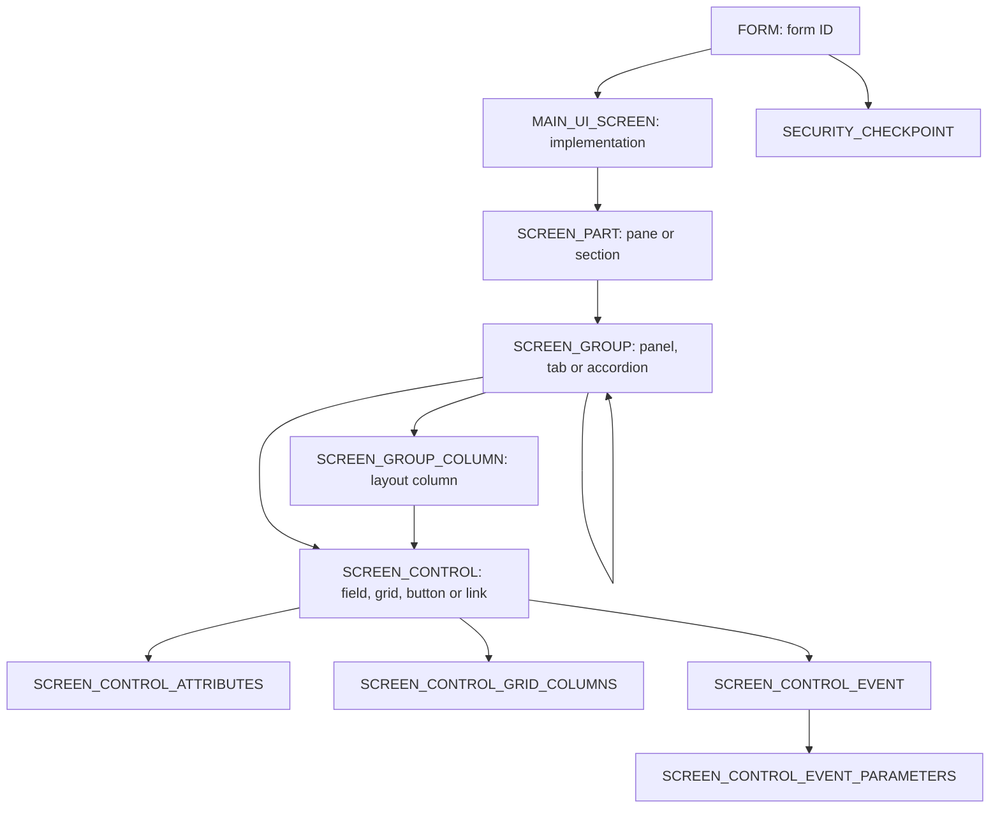

# Snapdragon / Insight Architect configuration model

Evidence date: 2026-10-02. The explanations below are grounded in the retained sources listed at the end and in [the historical schema excerpt](schema-index.json). They are a baseline for understanding the current installation, not instructions executed against production.

## What the tool configures

Insight Architect edits the metadata that SCALE uses to render web pages. Its hierarchy exposes literal database configuration with links between related records, list choices, preview, and script export. The SDK says Save clears cached metadata so changes become visible immediately. Opening a screen editor therefore exposes potentially effective configuration. During documentation, inspect the structure and leave with Cancel or X. Creating, activating, deleting, publishing, saving, or running a business action is outside this read-only review. [S02]

Five page families are documented. Insight pages filter data, display a list, show selected-record details, and expose actions. Monitor pages show charts and indicator tiles that drill down to an Insight page. Details pages provide create/read/update/delete interfaces. Transaction pages perform functions such as closing a container. Complex pages implement larger transactional functions such as packing and QC. A form record alone does not mean the form has a navigable Insight page. [S05]

## Route identity and navigation

| Purpose | Documented route | Identity carried in the route |
| --- | --- | --- |
| Inspect a form's metadata | `/scale/details/form/<formid>` | `FORM.FORM_ID`; opens the form entity in the metadata editor |
| Open an Insight page | `/scale/insights/<formid>` | The form ID of an Insight implementation |
| Alternate Insight route | `/scale/insight/index/<formid>` | The same Insight form ID |
| Edit/display a Details entity | `/scale/details/<entity>/<internalNum>` | Entity name and entity record identifier |
| New Details entity | `/scale/details/<entity>` | Entity name; documented insert mode |
| New child Details entity | `/scale/details/<parentEntity>/<parentId>/<childEntity>` | Parent entity identity plus child entity name |

The first route is explicitly documented by the SDK, whose source filename still includes `SnapDragon`. The two Insight routes are documented as interchangeable. Details routes use entity names and record identities, so a Details internal number must not be substituted for an Insight form ID. The current installation's `MAIN_UI_SCREEN.PATH`, `PATH_TYPE`, menu entry, preview target, and observed final URL must determine the runtime route. An error from a guessed Insight route is not sufficient evidence that the form or editor is unavailable. [S02, S03, S04]

The SDK describes a navigation trail of the last ten pages. Cancelled or completed Details/Transaction pages, sign-on pages, errors, and routes with `excludeFromNavTrail=Y` are excluded. Cancel is documented to return to the previous page through `_webUi.detailsScreenBinding.cancel`; `NavToPrev=Y` can alter the return behavior of dual-purpose transaction screens. Record the actual parent link and return behavior rather than assuming browser Back reproduces the application flow. [S18]

## Metadata hierarchy

| Object | Role and join | Configuration to record |
| --- | --- | --- |
| `FORM` | Highest-level screen identity. SDK says desktop, RF and metadata screens all have form records. | `FORM_ID`, resource key, table name, object identifier, associated form key; retain form type evidence |
| `MAIN_UI_SCREEN` | Screen implementation; `FORM_ID` references the form. | `OBJECT_ID`, active/base/custom flags, functional area, route path/type, object identifier, menu visibility, restrictions/default IDs |
| `SCREEN_PART` | Section of one implementation; `SCREEN_ID = MAIN_UI_SCREEN.OBJECT_ID`. | Name/type, sequence, active/base/custom flags, CSS, default action and partial-view flag |
| `SCREEN_GROUP` | Group within one part; `SCREEN_PART_ID = SCREEN_PART.OBJECT_ID`. | Group type/name, sequence, parent group, nested-tree root, loading type, fixed-top behavior, layout and default action |
| `SCREEN_GROUP_COLUMN` | Layout subdivision of one group. | Name, sequence, CSS class and flags |
| `SCREEN_CONTROL` | Control within a group; optional group-column reference. | Name/type, resource key, data-source type/value, default state, label orientation, tooltip, template, CSS and default action |
| `SCREEN_CONTROL_ATTRIBUTES` | One or more name/value settings tied to a control. | Attribute name/value, `IS_CONTROL_PROPERTY`, active/base/custom flags; separate HTML attributes from control properties |
| `SCREEN_CONTROL_GRID_COLUMNS` | Columns within a grid control. | Database expression/field and UI field name, type, sequence, visibility, width, primary-key flag, sorting and editing requirements |
| `SCREEN_CONTROL_EVENT` | Event bound to a control or grid column. | Event ID, JavaScript handler, grid column, active/base/custom flags |
| `SCREEN_CONTROL_EVENT_PARAMETERS` | Parameters supplied to the bound event. | Parameter name/value, event identity and flags |

The direct hierarchy is documented in S01 and S07–S12. The listed columns exist in the retained schema. The schema contains `FORM_ID` foreign keys from both `MAIN_UI_SCREEN` and `SECURITY_CHECKPOINT`, the part/group/control hierarchy, group self-parenting, group columns, and control children. Captured foreign keys are enabled and trusted; this establishes referential constraints in that snapshot, not current values or UI eligibility.

Nested groups matter: `PARENT_GROUP_ID` identifies the immediate parent; `NESTED_GROUP_UNIT` identifies the top group of the tree. A flat group count can miss nested tabs, accordion sections, or fields. Parts, groups and controls render in sequence order. Insight part names are documented as `SearchPane`, `ListPane`, and `DetailPane`. [S07, S08, S09]

Supporting structures include `FILTER_ATTRIBUTES` for advanced filter field behavior, `SECURITY_CHECKPOINT` for form actions, `MAIN_UI_WM_LICENSE_XREF` for screen/module linkage, and `FUNCTIONAL_AREA` for grouping. `SCREEN_PART_SEARCH` is present in the schema and includes user-specific search names/values; inventory its structure without treating personal saved search content as necessary screen documentation. Schema presence alone does not establish how current permission, menu, licensing or default rules combine. [S01, S20; schema reference]

## Data selection and configurability

For the documented Insight framework, the list grid's `data-dbtable` attribute identifies the table or view used to select the Insight data. Changing that target does not automatically repair references in search fields, columns, detail bindings or actions. The SDK warns that missing fields cause screen errors. Capture the dependency graph rather than inferring behavior from the displayed title or `FORM.TABLE_NAME` alone. [S16]

The three Insight panes have different responsibilities. Search has basic criteria, advanced criteria, field-type/operand definitions and menu actions. List has the result grid, grid columns, summary tiles and actions. Detail has selected-record bindings, its own retrieval procedure or service, indicator tiles and menu options. A screen review is incomplete if it only documents the list grid. [S19, S20]

`DATA_SOURCE_TYPE` determines how a control interprets `DATA_SOURCE`; the same text cannot be classified as a table, procedure, list or binding without the type. `IS_CONTROL_PROPERTY=N` denotes custom HTML attribute data in the SDK; a control property uses supported property semantics. Layout is controlled by CSS columns on parts, groups, group columns and controls. Document effects such as pane width, labels, grouping and visibility separately from their technical fields. [S09, S10, S17]

## Actions and permissions

An action is a control plus event binding plus parameters. `EVENT_ID` identifies the triggering event; `EVENT_NAME` names the JavaScript function; `GRID_COLUMN` can bind it to one grid column. Event parameters supply values to that handler. The SDK also documents `DOMCONTENTLOADED`, so some behavior can run when a page loads, without a user click. An observed menu item by itself does not establish its service, conditions, selected-record requirement, or effect. [S11, S12]

Dynamic actions can reference a form's `SECURITY_CHECKPOINT` through the control's `data-securitycheckpoint` attribute. The SDK describes custom checkpoint numbering beginning at 21; it also describes `EnableAction_...` parameters that enable or disable actions from selected data or another control. Security checkpoints override those data-driven enablement settings. Keep permission denial distinct from disabled-for-current-selection behavior and malformed-route behavior. Do not label an error harmless solely because broken links are known to occur. [S13, S14]

AIM describes user-, group- and system-level Security Permissions and says opening a window requires its Run action. It states that user-level records apply when present and that changed security requires a session refresh. This is product behavior evidence; it does not prove the current user's effective privileges or justify changing them while documenting screens. [S15]

## Customization and version differences

The retained sources differ and must remain separate:

| Source | Described model | What needs live confirmation |
| --- | --- | --- |
| SDK Metadata Page Architecture / Insight Architect | One form can have a base and custom screen implementation; only one active. `SYSTEM_CREATED=Y` identifies base records that the installer overwrites. Traverse the unchecked custom implementation to customize it. | Whether this installation has same-form base/custom implementation pairs and how the displayed flags correspond to them |
| AIM Insight Architect Configuration | SCALE Extend > Insight Architect provides Create New, Create Custom, View All, Edit, Activate/Deactivate, Delete and Publish. Create Custom creates a new form ID, activates custom and deactivates base. Publish moves a custom screen from Stage to Production for Manhattan Active SCALE. | Whether this workflow exists here, which form is associated with which base screen, and whether Publish is available |

These may reflect different product versions or workflows; the retained text alone does not resolve the difference. The mapping should retain both form identity and screen implementation identity, active/base/custom flags and any associated-form field. A customization inventory that merges records by title can hide the active implementation. [S01, S02, S06]

The later [installation capture](../database/DATABASE_EVIDENCE.md) provides a specific current example: Shipment form 2735 has active custom screen 1621 and inactive base screen 1786. The observed custom-screen catalog also lists form 2735. This confirms the same-form alternative structure for that installed screen; it does not establish the behavior of creating or publishing another customization.

The SDK also describes exporting versioned metadata scripts and clearing cached metadata on Save. Those are capability descriptions only. No export, edit, activation, deployment, script execution, service execution, or cache reset was performed for this reference. [S02]

## Sources

All source IDs resolve to original source URLs, capture timestamps, local structured articles, reading copies and verified original hashes in [source-index.json](source-index.json). The following local reading links are the principal entry points:

- S01: [Metadata Page Architecture](../../SDK/reading/2947132cd4956ea18b05a31ba95ea4781245188fab631288551ad3e8094e543a.md).
- S02: [Use Insight Architect to Customize a Metadata Page](../../SDK/reading/9d1879df4946560f87a878505496d9ada1e9ac63368517e75e0d9428da242ec2.md).
- S03–S04: [Insight Routing](../../SDK/reading/ccc1aae8a80a2a7d2adea682ec5ea212c5f1cce09cee04e1ecb93ca926404ddd.md), [Detail Routing](../../SDK/reading/805afa4cf87ebb7f1c5526cb02df505ae10e9901af8c830f340294d29a371a74.md).
- S05: [Getting Started: Metadata Web Pages](../../SDK/reading/8ee6f49a2b021d3afc072dfa645c329fc9a27d14e70d78292481b81816bba7e3.md).
- S06: [AIM Insight Architect Configuration](../../AIM/reading/f3f674c3e2fd06612c244e1cd317f8680d889de76937c30da3401e8c3d825906.md).
- S07–S12: [Parts](../../SDK/reading/6782568ac24669083b06b11cd8a7a49a257405092ee921de8c1e82be2ce21020.md), [groups](../../SDK/reading/d56eab375c6856ee498740b181674d34f75a61df99c10b442cf5a66ae9f2cef6.md), [controls](../../SDK/reading/bb522128265dc8e032acf43909a28cdb0383a4c646d9bddef63fdc9e27ce292e.md), [attributes](../../SDK/reading/c6f2b575ac93c80d7fed0743e021c3a4410aa69f0a1277ed7d8a2a7e7a692c93.md), [events](../../SDK/reading/eca9fc53f0fb038bdfb1d5f215e7b5f31082e710554ecde05af2dd256e790233.md), [event parameters](../../SDK/reading/7c5bf5af09ba93c382282549079eaedada01fb57e66568c67fe6581c0c707450.md).
- S13–S15: [Dynamic-action security](../../SDK/reading/ea6813660b3c5ccb1f434eac9531df5d9a8c30cbf3688a5bd93829d5f0c17698.md), [action enablement](../../SDK/reading/a5385c996c04755bfe676903a5875b0fc5a01570e1577f107dc6912527abddfd.md), [Security Permissions](../../AIM/reading/7455e0507949c7f8485e8beb4cca47f7576e8f57283c073b96738a810f6a52f7.md).
- S16–S20: [Table/view binding](../../SDK/reading/856e778e191b0e1d2643c4c616c244f3bf0ec9dc0e4a86c337c1bdd439c27deb.md), [layout](../../SDK/reading/3e44ad548e37cf09f0ac2d94e96aa3ca82d1ef4f54e2fdee4d428464bff0bc71.md), [navigation](../../SDK/reading/a03f71cb8cae9c22bd9479d1024193cb2ffd44f8d36ce5d03da0d46bc69d17b7.md), [modify an Insight](../../SDK/reading/230d21f4da0a746491eba71312cd1c11c1e9e1541dfd7fd3a375f63db9c4f88a.md), [create an Insight](../../SDK/reading/415e9533a003649b106a5f25ca16876033ee5d104a1e6f8ec9698b82a33059c9.md).
