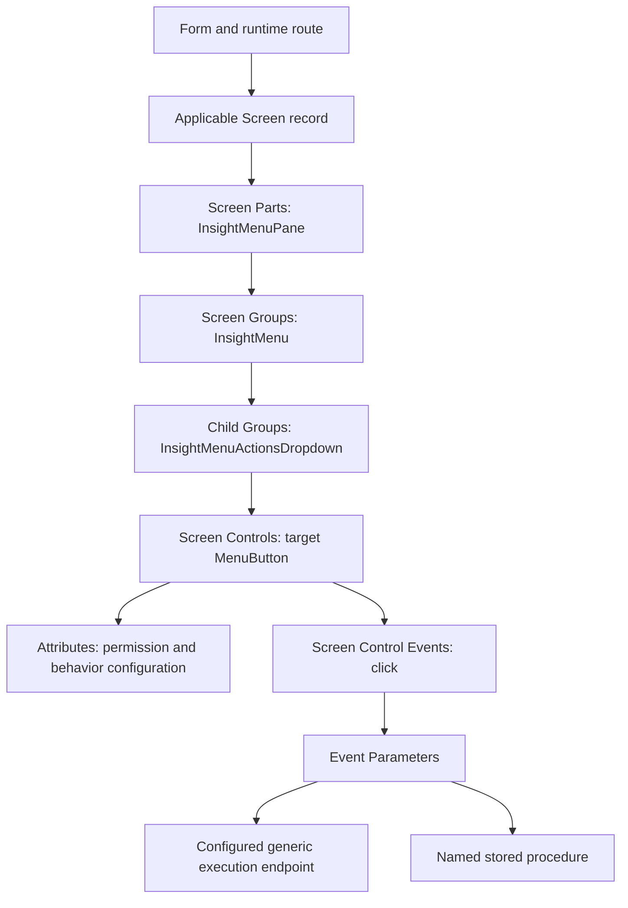

# Sam's Snapdragon training: navigation and configuration reference

Reviewed 2026-10-02 against private repository [`edfortheblind/sp-insight-screen`](https://github.com/edfortheblind/sp-insight-screen/tree/44c70453f9249b2fda38d0279378b93d2422ead1), commit `44c70453f9249b2fda38d0279378b93d2422ead1` (committed 2026-08-19). This is historical training evidence. Current `trav.manhscale.com` observations and replica metadata must independently establish today's screen IDs, configuration, and accessibility.

Sam's walkthrough explains how to find an Insight's constituent configuration records and trace a custom Actions menu item to its handler, parameters, permission checkpoint, and stored procedure. It supplies a navigation method and several inventory seeds; it does not enumerate SCALE or validate every possible configuration feature.

## Evidence and review coverage

The source repository contains a 277-segment transcript of an approximately 11-minute recording and 124 extracted JPEG frames. This review read the complete transcript and the existing source-inspection, visual-analysis, session-analysis, cheat-sheet, and transcription-quality documents. It directly inspected 25 selected frames to confirm navigation, fields, action lists, IDs, and important discrepancies. The original video/audio is not tracked in that repository and was not replayed. The transcription report explicitly warns that technical terms and speaker attribution are imperfect.

- [Transcript](https://github.com/edfortheblind/sp-insight-screen/blob/44c70453f9249b2fda38d0279378b93d2422ead1/output/transcript.md)
- [Source visual notes](https://github.com/edfortheblind/sp-insight-screen/blob/44c70453f9249b2fda38d0279378b93d2422ead1/output/02_visual_analysis_notes.md)
- [Prior session analysis](https://github.com/edfortheblind/sp-insight-screen/blob/44c70453f9249b2fda38d0279378b93d2422ead1/output/SCALE_SESSION_ANALYSIS.md)
- [Transcription quality report](https://github.com/edfortheblind/sp-insight-screen/blob/44c70453f9249b2fda38d0279378b93d2422ead1/output/transcription_report.md)
- [Source manifest and hashes](source_manifest.json)
- [Historical identifiers, suitable as discovery seeds](navigation_seeds.json)

The six review deliverables are complete: source provenance, navigation hierarchy, seed identifiers, demonstrated configuration, caveat audit, and current-verification backlog. This is **6/6 training-review deliverables (100%)**, not a measure of live SCALE coverage. Direct frame reinspection is **25/124 (20.16%)**. Historical training examples do not count toward live navigation completion.

## How to navigate the configuration hierarchy

Use the current environment's verified Form/Screen relationship before following child links. The owner's current entry example is `/scale/details/form/2796` for Purchase Order Insight, whose runtime path is `/scale/insights/2796`; this entry method comes from the present task, not Sam's recording. Keep Form ID, main UI Screen ID, Screen Part ID, Screen Group ID, Control ID, Event ID, and Parameter ID separate.

Sam's demonstrated path is:

1. Open the applicable **Screen** record.
2. Expand **Screen Parts**, then open **InsightMenuPane**.
3. Expand that part's **Screen Groups**, then open **InsightMenu**.
4. Expand **Child Groups**, then open **InsightMenuActionsDropdown**.
5. Expand **Screen Controls** and follow the target control's name.
6. Read **Control Properties**, **Style Properties**, **Binding Properties**, and **Screen Control Attributes**.
7. Expand **Screen Control Events**, then open **click**.
8. Read **Event Properties**, expand **Event Parameters**, and follow each parameter record to its value and **General** metadata.

The nested group navigation matters: on the Screen Group page the next group is under **Child Groups**. The source cheat sheet sometimes calls both group levels “Screen Groups,” which can obscure this distinction. Each grid can be paginated; read its total and traverse every page before calling that level complete. The training shows 23 Shipment actions over three pages and 14 Wave actions over two pages. [Shipment hierarchy frames](https://github.com/edfortheblind/sp-insight-screen/blob/44c70453f9249b2fda38d0279378b93d2422ead1/frames/00-00-07_scene_0002.jpg), [Wave group frame](https://github.com/edfortheblind/sp-insight-screen/blob/44c70453f9249b2fda38d0279378b93d2422ead1/frames/00-04-03_scene_0044.jpg).

The Form-to-Screen link in the diagram is a discovery requirement; Sam's recording starts inside Screen configuration. A route's numeric Form ID must not be substituted for its main UI Screen ID.

## Configuration surfaces visible in the training

| Object | Sections available | What the reviewed example establishes |
|---|---|---|
| Screen | Screen Properties; Screen Parts; General; User Defined | Runtime route and constituent parts can be inspected; Shipment Screen 1028 has seven displayed parts. |
| Screen Part | Part Properties; Style Properties; Screen Groups; General; User Defined | `InsightMenuPane` contains the group hierarchy for the Insight menu. |
| Screen Group | Group Properties; Style Properties; Child Groups; Screen Controls; Screen Group Columns; General; User Defined | Groups can nest; menu controls and layout columns are separate collections. |
| Screen Control | Control Properties; Style Properties; Binding Properties; Screen Control Attributes; Screen Control Events; Screen Control Grid Columns; General; User Defined | Name, type, resource keys, order, CSS, binding, attributes, event wiring, and grid-column configuration have distinct locations. |
| Screen Control Event | Event Properties; Event Parameters; General; User Defined | `click` identifies the event; Event Name holds the handler; parameters are child records. |
| Event Parameter | Parameter Properties; General; User Defined | Parameter name/value, parent event, active/system-created indicators, object ID, and stamps are visible. |

The examples show these section labels, not every allowed field value or control type. The Upload Shipment control has zero Screen Control Grid Columns; that does not imply grid columns are unused throughout Snapdragon. [Control sections](https://github.com/edfortheblind/sp-insight-screen/blob/44c70453f9249b2fda38d0279378b93d2422ead1/frames/00-01-04_scene_0007.jpg), [event and grid columns](https://github.com/edfortheblind/sp-insight-screen/blob/44c70453f9249b2fda38d0279378b93d2422ead1/frames/00-02-44_scene_0015.jpg), [parameter metadata](https://github.com/edfortheblind/sp-insight-screen/blob/44c70453f9249b2fda38d0279378b93d2422ead1/frames/00-09-25_scene_0109.jpg).

Shipment's seven parts are `SaveSearchModalDialog`, `SplitShipmentConfirmationModalDialog`, `GadgetCalculationQueryDialog`, `InsightMenuPane`, `SearchPane`, `ListPane`, and `DetailPane`. Its `InsightMenu` has six displayed child groups: `InsightMenuPanel`, `InsightMenuFavoritesDropdown`, `InsightListPaneMenuPanel`, `MenuExportToExcelPanel`, `InsightMenuActionsDropdown`, and `InsightMenuPrintActionsDropdown`. Wave's corresponding `InsightMenu` has five displayed child groups; the separate Print Actions group is absent in that observed list. These are concrete examples of shared structure with per-screen variation. [Parts](https://github.com/edfortheblind/sp-insight-screen/blob/44c70453f9249b2fda38d0279378b93d2422ead1/frames/00-00-00_scene_0001.jpg), [Shipment groups](https://github.com/edfortheblind/sp-insight-screen/blob/44c70453f9249b2fda38d0279378b93d2422ead1/frames/00-00-07_scene_0002.jpg), [Wave groups](https://github.com/edfortheblind/sp-insight-screen/blob/44c70453f9249b2fda38d0279378b93d2422ead1/frames/00-04-03_scene_0044.jpg).

## Historical IDs and their evidence limits

| Entity | Identifier | Evidence | Confidence / use |
|---|---:|---|---|
| Shipment/List Insight runtime form | 2735 | Runtime path displayed in Screen heading at 00:00 | ID high; descriptive name inferred from Shipment control names. |
| Shipment main UI Screen | 1028 | Address `/scale/details/mainuiscreen/1028` at 00:00 | High; observed on `manh-gdynstg`, not current Travis host. |
| Shipment InsightMenu group | 8448 | Address `/scale/details/screengroup/8448` at 00:07 | High; same historical staging environment. |
| Wave Insight runtime form | 2773 | Runtime path and `MNU_WAVEINSIGHT` at 03:51; SQL result at 07:48 | High; historical `manh-trav3pl` environment. |
| Wave InsightMenuPane part | 852 | Address `/scale/details/screenpart/852` at 03:58 | High; historical `manh-trav3pl`. |
| Wave InsightMenu group | 3601 | Address `/scale/details/screengroup/3601` at 04:03 | High; historical `manh-trav3pl`. |
| Wave example control event | 6607 | Screen Control Event ID link in parameter General section at 09:25 | High; parent relationship confirmed, route not visible. |
| Wave example event parameter | 11034 | Object ID in parameter General section at 09:25 | High; exact detail-route spelling not established. |
| Inventory Insight runtime form | 2723 | Prior analysis reports browser history entries | Medium; history-only secondary extraction, not a demonstrated screen inspection. |

Two records for Wave's `/scale/insights/2773` path appear together: one marked System Created and a separate row marked Active. Preserve both candidate Screen records and their flags during discovery; the training does not establish a universal precedence rule. [Wave record list](https://github.com/edfortheblind/sp-insight-screen/blob/44c70453f9249b2fda38d0279378b93d2422ead1/frames/00-03-51_scene_0037.jpg).

## Demonstrated custom Actions-menu configuration

The following documents the pattern Sam explains. No controls, permissions, procedures, or runtime business actions were created or executed by this review.

| Setting | Demonstrated value or guidance | Evidence strength |
|---|---|---|
| Parent group | `InsightMenuActionsDropdown` | Visually confirmed. |
| Control Type | `MenuButton` | Visually confirmed; Sam instructs this type for the pattern. |
| Control Name | Convention `ListPaneMenuAction<Name>` | Convention, not a proven platform constraint. |
| Resource Key | E.g. `UPLOADSHIPMENT`, `EX01_REPRINTCCL` | Identifies the displayed label's resource; literal rendered wording can differ. |
| Tooltip Resource Key | Same key as label in Upload Shipment example | Visually confirmed. |
| Sequence | E.g. Upload Shipment `6600`, ReprintCCL `2845` | Ordering field; Sam recommends unused values, but uniqueness is not proven. |
| Control Css Class | `dropdownaction` | Visually confirmed. |
| Other style/binding settings | Blank in the demonstrated MenuButton example | Pattern-specific; do not generalize to bound controls. |
| Attribute | `data-allowOnMultiSelect` = `False` / `false` in examples | Value confirmed; Sam expresses uncertainty about its behavior. |
| Attribute | `data-securityCheckpoint` = `25` in Wave example | Value confirmed; Sam connects it to existing Reprint Docs permission. |
| Event ID | `click` | Visually confirmed. |
| Event Name | `_webUi.insightListPaneActions.menuActionPerformPost` | Visually confirmed on Upload Shipment; documented as the custom-action pattern. |

Sam describes using Add for control/event-parameter records and saving their settings. The review captures configuration knowledge without reproducing those writes. [Transcript 00:20–01:28 and 10:24–10:53](https://github.com/edfortheblind/sp-insight-screen/blob/44c70453f9249b2fda38d0279378b93d2422ead1/output/transcript.md), [style](https://github.com/edfortheblind/sp-insight-screen/blob/44c70453f9249b2fda38d0279378b93d2422ead1/frames/00-02-26_scene_0012.jpg), [attributes](https://github.com/edfortheblind/sp-insight-screen/blob/44c70453f9249b2fda38d0279378b93d2422ead1/frames/00-04-30_scene_0050.jpg).

The Wave example's three event parameters are exactly:

| Parameter Name | Parameter Value |
|---|---|
| `POSTServiceURL` | `/general/scaleapi/genericDataExecutionApi` |
| `PostData_Grid_ListPaneDataGrid_INTERNAL_LAUNCH_NUM` | `WAVE_NUMBER` |
| `PostData_storedProcedure` | `TRAV_EX01_ReprintPS` |

All three show Active. The UI-to-procedure parameter translation is **not fully established** by the recording; retain the exact name/value pair instead of asserting which substring is matched positionally or by name. Sam explicitly questions why the names do not match the procedure's `@INTERNAL` parameter at 09:51–10:15. [Exact parameter grid](https://github.com/edfortheblind/sp-insight-screen/blob/44c70453f9249b2fda38d0279378b93d2422ead1/frames/00-09-28_scene_0111.jpg).

## Wave example: user-facing function and configured actions

The live Wave list displays columns Icon, Wave, Status, Name, Current Wave Step, Flow, Total Shipments, Total Lines, and Released. Its visible menu offers Build, Cancel, Reprint Documents, Reprint Labels, Resend PS Data, Mark for Packsize, Reprint Picking Pending, Release, and Run. The recording has an empty result list; it does not validate business-action outcomes. [Runtime Wave view](https://github.com/edfortheblind/sp-insight-screen/blob/44c70453f9249b2fda38d0279378b93d2422ead1/frames/00-03-50_scene_0035.jpg).

The configuration list contains 14 MenuButton records. The display label, resource key, control name, and target procedure are distinct identities; `ListPaneMenuActionReprintCCL`, `EX01_REPRINTCCL`, the visible “Reprint Picking Pending” menu wording, and `TRAV_EX01_ReprintPS` are associated in the walkthrough but are not interchangeable naming conventions.

| Control Name | Resource Key | Sequence |
|---|---|---:|
| `ListPaneMenuActionNewWave` | `NEW` | 1250 |
| `ListPaneMenuActionEditWave` | `EDIT` | 1500 |
| `ListPaneMenuActionViewWave` | `VIEW` | 1750 |
| `ListPaneMenuActionDeleteWave` | `DELETE` | 2000 |
| `ListPaneMenuActionBuildWave` | `BUILDWAVE` | 2250 |
| `ListPaneMenuActionCancelLaunch` | `MNU_CANCELWAVE` | 2500 |
| `ListPaneMenuActionReprintwaveDocs` | `REPRINTDOCS` | 2600 |
| `ListPaneMenuActionReprintWaveLabels` | `REPRINTWAVELABELS` | 2750 |
| `ListPaneMenuActionResendPSData` | `EX01_RESENDPSDATA` | 2825 |
| `ListPaneMenuActionMarkForPS` | `EX01_MARKFORPS` | 2835 |
| `ListPaneMenuActionReprintCCL` | `EX01_REPRINTCCL` | 2845 |
| `ListPaneMenuActionReleaseWave` | `RELEASE` | 3000 |
| `ListPaneMenuActionRunWave` | `RUNWAVE` | 3250 |
| `ListPaneMenuActionRunWavePrinterSelection` | `RUNWAVEPRINTERSELECTION` | 3500 |

Sources: [first ten records](https://github.com/edfortheblind/sp-insight-screen/blob/44c70453f9249b2fda38d0279378b93d2422ead1/frames/00-08-27_scene_0098.jpg), [last four records](https://github.com/edfortheblind/sp-insight-screen/blob/44c70453f9249b2fda38d0279378b93d2422ead1/frames/00-08-33_scene_0100.jpg), supported by the source visual notes. These are historical values and do not assert today's Travis action count.

## Permissions and database context

Sam explains that `data-securityCheckpoint` refers to a permission associated with the Form ID. He reuses checkpoint 25, the existing Reprint Docs permission. He describes adding a new checkpoint as requiring a corresponding configuration-table row and cloud-team involvement; this is historical process guidance, not a verification of current access or policy. No checkpoint-table name is legible in the reviewed training evidence.

The visible historical Wave checkpoint result is:

| Form ID | Check Point | Resource File Key |
|---:|---:|---|
| 2773 | 1 | `RUN` |
| 2773 | 23 | `SAVESEARCH` |
| 2773 | 24 | `REPRINTWAVELABELS` |
| 2773 | 25 | `REPRINTDOCS` |
| 2773 | 29 | `RELEASEWAVE` |

[SQL result frame](https://github.com/edfortheblind/sp-insight-screen/blob/44c70453f9249b2fda38d0279378b93d2422ead1/frames/00-07-48_scene_0091.jpg). `dbo.CheckSecurityPermission` appears as an object name, but the recording does not show its body or prove the precise enforcement path.

The displayed `dbo.TRAV_EX01_ReprintPS` definition takes `@INTERNAL`, `@username`, `@error OUTPUT`, and `@success OUTPUT`; selects `shipping_container.container_id` where `LAUNCH_NUM=@INTERNAL`, the container ID is not null, and status is 300; then inserts a `CTN_PRINT` command into `DIF_INCOMING_MESSAGE` for each selected container, with Ready status and `DIFIncomingMessageHandler.HandleMessage` as process stamp. It is a mutating integration action, not a query-only report. The full INSERT trails outside the image boundary. The actual downstream handler, successful print, and meaning of status 300 are not demonstrated. [Procedure frame](https://github.com/edfortheblind/sp-insight-screen/blob/44c70453f9249b2fda38d0279378b93d2422ead1/frames/00-10-25_scene_0116.jpg).

This definition is evidence about the demonstrated procedure only. Do not infer that every SCALE action calls this generic endpoint or that every print operation follows this queue pattern. Procedure names ending in `_InsightDetailPaneData` and `_InsightListPaneData` are useful search seeds for current metadata correlation, not proof of every screen's binding.

## Corrections to carry into the new documentation

| Earlier-source claim or ambiguity | Evidence-aware interpretation |
|---|---|
| The entire walkthrough is on production | Initial screenshots use `manh-gdynstg`; the later Wave demonstration uses `manh-trav3pl` with a production banner. |
| Sequence values must be unique | Sam recommends avoiding duplicate values. The Shipment grid visibly has two records with sequence 3250; enforcement and tie ordering remain unverified. |
| `data-allowOnMultiSelect=false` definitively greys out an action | Sam retracts confidence in the behavior at 02:18–02:33. Preserve the observed attribute and mark runtime semantics pending. |
| A Resource Key is the literal label | Keys such as `EX01_REPRINTCCL` differ from rendered user text. Document key and resolved label separately. |
| All Actions-menu entries invoke a stored procedure through the same handler | The recording establishes one configuration pattern and selected examples, not every handler or every screen. |
| The parameter-name suffix does not need to match the procedure parameter | Sam questions the behavior; no controlled comparison or runtime payload trace is present. |
| The procedure source is complete | Significant lines are cut off at the frame's right edge. Read the actual definition before documenting complete behavior. |
| Checkpoint omission means unrestricted execution | The absence of a control attribute alone cannot establish all upstream or server-side permissions. |
| Screenshot timestamps in prior visual notes precisely identify content | Some notes are offset: the clear Upload Shipment event/attribute frame is 02:44, while 02:26 primarily shows style/binding fields. Prefer the actual linked frame. |

[Duplicate sequence screenshot](https://github.com/edfortheblind/sp-insight-screen/blob/44c70453f9249b2fda38d0279378b93d2422ead1/frames/00-00-14_scene_0004.jpg), [uncertainty in transcript](https://github.com/edfortheblind/sp-insight-screen/blob/44c70453f9249b2fda38d0279378b93d2422ead1/output/transcript.md).

## Backlog for the current environment

| Task | Completion evidence required | Training evidence alone |
|---|---|---|
| Discover all navigable Forms | Current configuration inventory, exact denominator, route family and status per ID | Not supplied. |
| Resolve Forms to UI Screens | Current links or database relationships including active/system-created alternatives | Pattern and historical examples only. |
| Walk each screen's configuration tree | All parts, recursive groups, controls, attributes, events, parameters, and grid columns accounted for | One narrow Actions-menu branch demonstrated. |
| Map runtime fields and menus | Current label, key, type, purpose, read-only interaction, and route evidence | Wave/Shipment examples only. |
| Link data sources and custom logic | Current metadata/source definitions with confidence labels | Procedure names and one partial definition. |
| Confirm permission relationships | Current checkpoint-table identity, form/checkpoint links, and configuration evidence | Five historical Wave checkpoints. |
| Resolve semantic uncertainties | Source-backed resolution of parameter mapping, multiselect behavior, order ties, status codes, and action availability | Explicitly pending. |
| Characterize broken navigation | Attempted route, visible message, known working route, and current outcome | No evidence that all warnings share one cause. |

The root Snapdragon roadmap should count these live work items independently from this completed training extraction.
